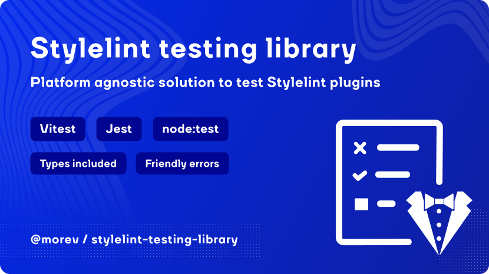

# @morev/stylelint-testing-library

Platform agnostic solution for testing Stylelint plugins.

✔️ Works with any popular testing platform - `vitest`, `jest`, `node:test`; \
✔️ Provides clean and configurable test output, handy and helpful error messages; \
✔️ Reduces the amount of boilerplate code due to a nice public API; \
✔️ First-class TypeScript support, written in TS.

For more details on installation, API and more, [go to the documentation website](https://morevm.github.io/stylelint-testing-platform/).
